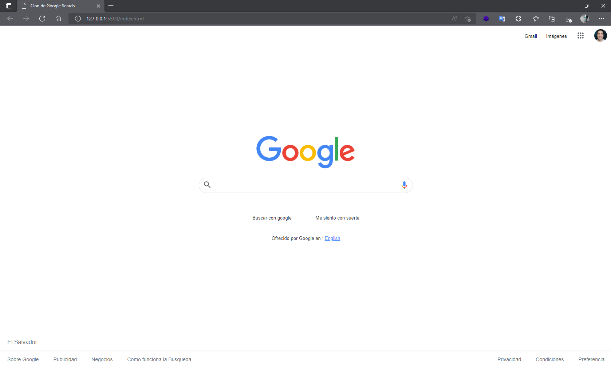
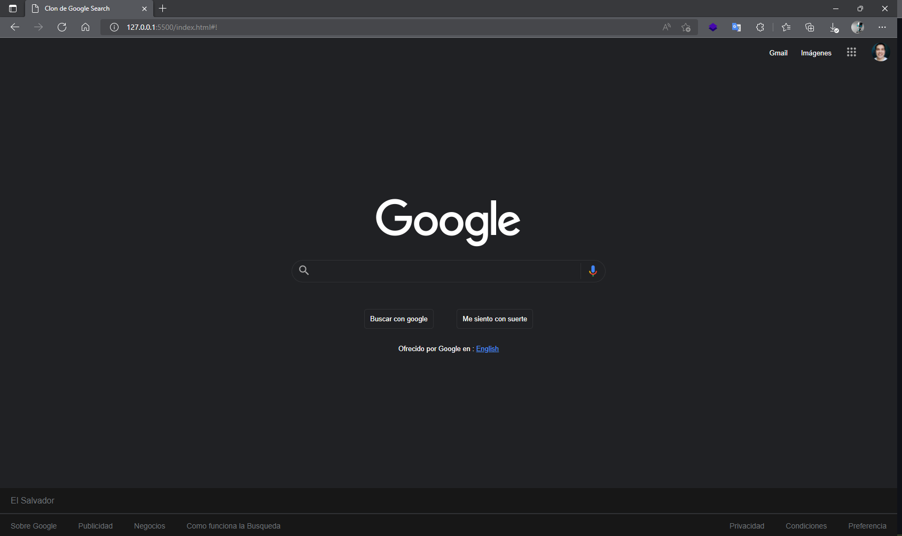

# CLON DEL BUSCADOR DE GOOGLE

En este proyecto realizo la maquetacion de la pagina del buscador de google, aplicando los conocimientos adquiridos en mis estudios de HTML Y CSS.

Este es una primera version del mismo, ya que pienzo irle agregando modificaciones usando JavaScript, para agregar mayor interactividad al sitio.

> Se agrega funcionalidad del buscador, ya funciona con JavaScript

> Se agrega funcionalidad del Dark Mode

  No se realiza al 100% de detalle ya que mi forma de realizar el Dark Mode fue usando variables CSS (CustomProperties) con lo cual solo modifique las variables, sin tocar nada mas que en este caso la imagen del logo.

# Forma de ver/usar

1. Solo debe de descargar el archivo .zip 
2. descomprimirlo busque el archivo html `index.html`.
3. Doble click en `index.html`.
4. se desplegara la pagina, clon del buscador de google
5. Escriba en el buscador de google lo que desea
6. De enter o presione el boton 'Buscar con google'
7. En la seccion del footer puedes clickear en el enlace 'Preferencia' y cambiara al DarkMode

# Tecnologias usadas

- HTML
- CSS
- javaScript